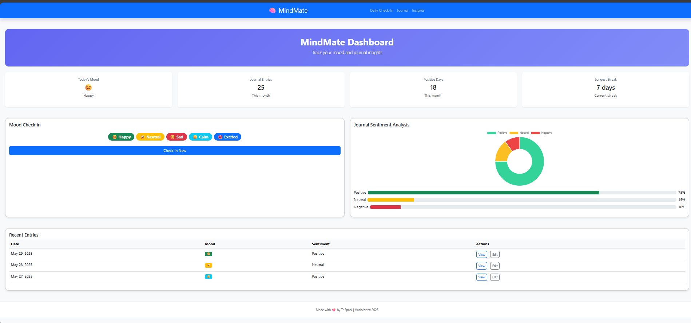
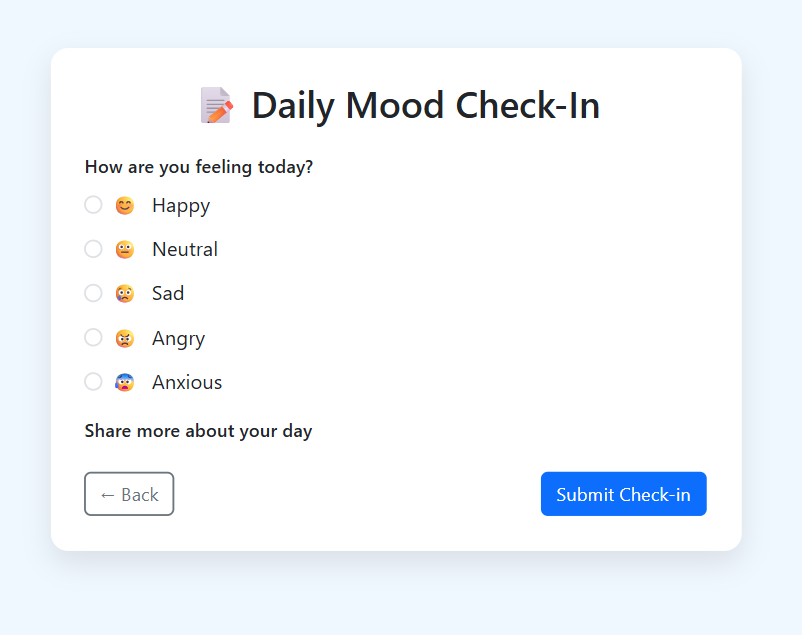
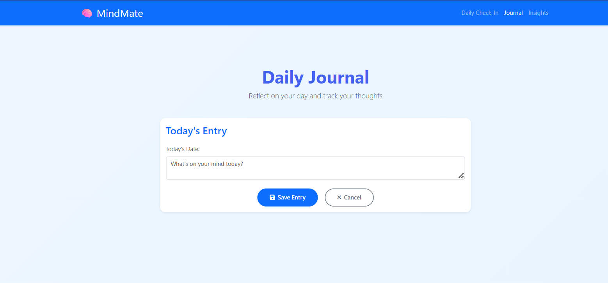

# 🧠 MindMate – Mental Health Micro-Coach for Students

## 💡 Problem Statement

College students silently struggle with **stress, anxiety, burnout**, and **academic pressure**. Most hesitate to seek therapy due to **stigma**, **cost**, or **inaccessibility**.

There’s a strong need for a **private, intelligent, and stigma-free digital companion** that supports students emotionally every day.

---

## 🚀 Solution

**MindMate** is a web-based AI-powered micro-coach for students. It helps track emotional health, encourages self-reflection, and provides **personalized CBT-based nudges**.

### ✅ Core Features:
- ✍️ **AI-powered journaling** with sentiment/emotion analysis  
- 🌈 **Mood check-ins** with emojis and note tracking  
- 🧠 **CBT micro-habits and nudges** for healthy thinking patterns  
- 📈 **Insights dashboard** with emotional history  
- 🛟 Optional: **anonymous peer support** (future scope)  
- 🔐 **Privacy-first design** — everything is local & secure  

---

## 📈 Impact

- Helps students build **emotional self-awareness**
- Offers **affordable, accessible mental health support**
- Can integrate into **college portals or LMS**
- Encourages **early intervention** and mental habit-building

---

## ⚙️ Tech Stack

| Layer       | Technology                              |
|-------------|------------------------------------------|
| Frontend    | HTML5 + CSS + Bootstrap (Flask templates) |
| Backend     | Flask (Python REST API)                  |
| Database    | SQLite (local), PostgreSQL (prod-ready)  |
| NLP Engine  | TextBlob (prototype), HuggingFace ready  |
| Sentiment   | VADER / DistilBERT                       |
| Hosting     | Localhost for demo                       |

---

## 🖥️ Version Note

> 🧪 This is a **Flask-based prototype** of MindMate for HackVortex Round 1. React Native version (mobile-first) planned for post-event.

---

## DEMO:  https://drive.google.com/file/d/1krrLNE4mkR-2A9xYkV3e_5vNRvfG8X2R/view?usp=drive_link

## PPT: https://docs.google.com/presentation/d/1s8kTCPvzEI56HJNzC2F77yfRk0yD2_RA/edit?usp=sharing&ouid=117920342579121468319&rtpof=true&sd=true

### 🏠 Home Page  


### 🎭 Mood Check-In  


### 📓 Journal  



## 🛠️ Setup & Run Instructions

### 🔧 Backend (Flask)

```bash
git clone https://github.com/saritakumari23/mindmate-hackvortex2025.git
cd mindmate-hackvortex2025/mindmate
pip install -r requirements.txt
python app.py
